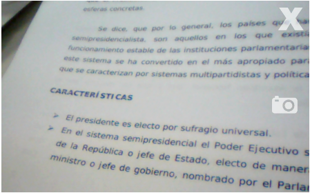

# Huayra-CAM

Una aplicación para tomar fotografías con tu netbook de la misma forma que lo hacés con tu celular.    Sólo tenés que abrir la aplicación y tomar la foto con la barra espaciadora o el ícono de cámara.  Todas las fotos se guardarán automáticamente en la carpeta “Imágenes”.

#Licencia

Realizado por Diego Accorinti (@diegoacco) para Huayra GNU/Linux · 2016
Software libre bajo licencia GPL3 
basado en https://github.com/sergiovilar/camera

This program is free software; you can redistribute it and/or modify
 it under the terms of the GNU General Public License as published by
the Free Software Foundation; either version 2 of the License, or
(at your option) any later version.

This program is distributed in the hope that it will be useful,
but WITHOUT ANY WARRANTY; without even the implied warranty of
MERCHANTABILITY or FITNESS FOR A PARTICULAR PURPOSE.  See the
GNU General Public License for more details.
